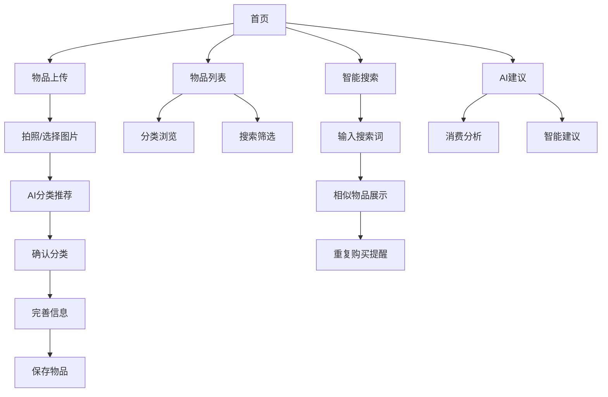

## 1. 产品概述

SeeIt是一款智能物品管理应用，帮助用户通过拍照上传的方式记录和管理个人物品，提供智能分类、相似物品搜索和AI消费建议功能，帮助用户更好地管理个人物品，避免重复购买和过度消费。

目标用户：注重生活管理、希望理性消费的个人用户，特别是有收纳整理需求的都市人群。

## 2. 核心功能

### 2.1 用户角色

| 角色 | 注册方式 | 核心权限 |
|------|----------|----------|
| 普通用户 | 邮箱/手机号注册 | 物品上传、分类管理、搜索查询、查看AI建议 |
| 访客用户 | 无需注册 | 浏览示例功能、限制上传数量 |

### 2.2 功能模块

SeeIt应用程序包含以下核心页面：

1. **首页**：功能导航、物品统计概览、快速上传入口
2. **物品上传页**：拍照上传、AI分类推荐、手动分类调整
3. **物品列表页**：分类浏览、搜索筛选、物品详情查看
4. **搜索结果页**：相似物品展示、重复购买提醒
5. **AI建议页**：消费分析报告、重复购买预警、理性消费建议
6. **个人中心**：用户信息、设置、数据导出

### 2.3 页面详情

| 页面名称 | 模块名称 | 功能描述 |
|----------|----------|----------|
| 首页 | 导航栏 | 显示应用logo、用户头像、快速上传按钮 |
| 首页 | 统计概览 | 显示物品总数、分类数量、本月新增数量 |
| 首页 | 快速功能区 | 拍照上传、查看分类、搜索物品、AI建议入口 |
| 物品上传页 | 拍照模块 | 支持拍照和从相册选择，自动压缩优化图片 |
| 物品上传页 | AI分类推荐 | 基于图像识别推荐3-5个分类选项 |
| 物品上传页 | 信息完善 | 手动输入物品名称、品牌、价格、购买时间等 |
| 物品列表页 | 分类导航 | 树形分类结构，支持多级分类浏览 |
| 物品列表页 | 搜索筛选 | 按名称、品牌、分类、时间范围筛选 |
| 物品列表页 | 物品卡片 | 显示缩略图、名称、分类、添加时间 |
| 搜索结果页 | 相似度展示 | 按相似度排序显示匹配的物品 |
| 搜索结果页 | 重复提醒 | 高相似度物品显示重复购买警告 |
| AI建议页 | 消费分析 | 展示购买频率、分类支出统计 |
| AI建议页 | 智能建议 | 基于历史数据提供理性消费建议 |
| 个人中心 | 用户信息 | 显示头像、昵称、注册时间 |
| 个人中心 | 设置选项 | 分类管理、数据导出、隐私设置 |

## 3. 核心流程

### 用户主要操作流程：

1. **物品录入流程**：用户拍照 → AI识别分类 → 用户确认/调整 → 完善信息 → 保存到对应分类
2. **搜索查询流程**：用户输入搜索词 → 系统图像/文字匹配 → 展示相似物品 → 查看详情
3. **AI建议流程**：系统分析用户数据 → 识别购买模式 → 生成消费建议 → 推送给用户

## 4. 用户界面设计

### 4.1 设计风格

- **主色调**：清新绿色（#4CAF50）代表环保理性消费，搭配白色背景
- **辅助色**：浅灰色（#F5F5F5）用于卡片背景，深灰色（#666666）用于文字
- **按钮样式**：圆角矩形，扁平化设计，主要操作用主色调
- **字体**：系统默认字体，标题18px，正文14px，辅助文字12px
- **布局风格**：卡片式布局，顶部导航+底部标签栏的双导航结构
- **图标风格**：使用简洁的线性图标，保持视觉一致性

### 4.2 页面设计概览

| 页面名称 | 模块名称 | UI元素 |
|----------|----------|--------|
| 首页 | 导航栏 | 左侧logo，右侧用户头像和上传按钮，白色背景，底部阴影 |
| 首页 | 统计卡片 | 圆角矩形卡片，渐变绿色背景，白色数字，图标使用emoji风格 |
| 物品上传页 | 图片预览 | 全屏图片预览，底部叠加操作按钮，半透明背景 |
| 物品上传页 | 分类选择 | 横向滑动的分类标签，选中的分类使用主色调高亮 |
| 物品列表页 | 物品网格 | 2列网格布局，卡片阴影效果，图片占满卡片上半部分 |
| 搜索结果页 | 相似度标识 | 使用进度条样式显示相似度百分比，颜色从红到绿渐变 |
| AI建议页 | 数据图表 | 使用简洁的柱状图和饼图，绿色主题配色 |

### 4.3 响应式设计

- **移动端优先**：针对手机屏幕优化，支持iOS和Android
- **自适应布局**：支持平板横屏显示，调整网格列数和卡片大小
- **触摸优化**：按钮最小44px触摸区域，支持滑动操作
- **图片适配**：根据设备分辨率加载合适尺寸的图片