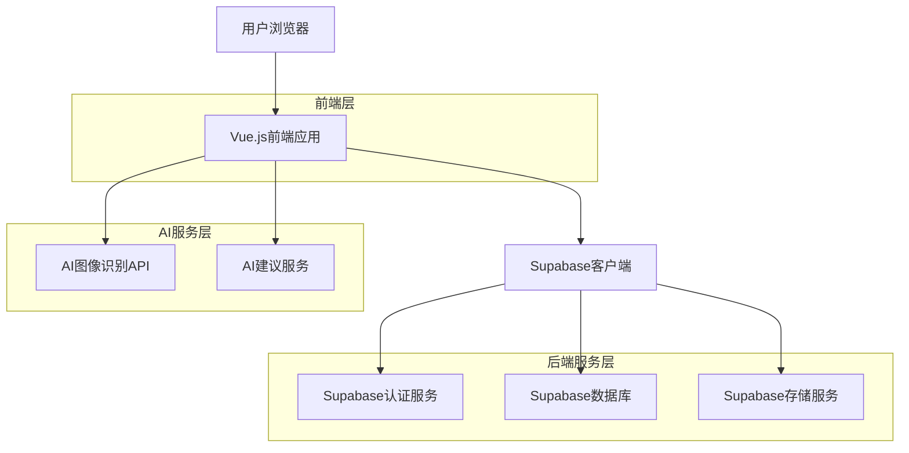
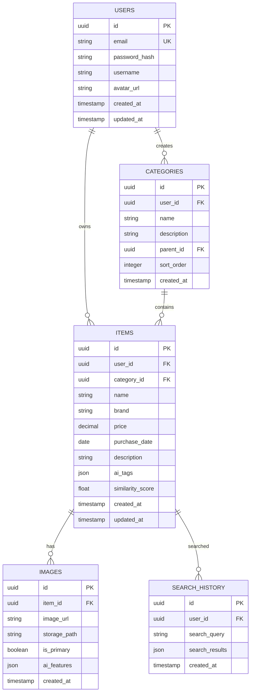

## 1. 架构设计



## 2. 技术描述

- **前端**: Vue.js@3 + Vite + TypeScript + Tailwind CSS
- **后端服务**: Supabase (PostgreSQL数据库 + 认证 + 文件存储)
- **AI服务**: 第三方图像识别API + 自研建议算法
- **状态管理**: Pinia
- **路由**: Vue Router@4
- **UI组件库**: Element Plus
- **图片处理**: Compressor.js

## 3. 路由定义

| 路由 | 用途 |
|-------|---------|
| / | 首页，展示功能导航和统计概览 |
| /upload | 物品上传页面，支持拍照和图片选择 |
| /items | 物品列表页面，分类浏览和搜索 |
| /items/:id | 物品详情页面 |
| /search | 搜索结果页面 |
| /ai-advice | AI建议和消费分析页面 |
| /profile | 个人中心页面 |
| /login | 用户登录页面 |
| /register | 用户注册页面 |

## 4. 数据模型

### 4.1 数据库实体关系图



### 4.2 数据定义语言

用户表 (users)
```sql
-- 创建用户表
CREATE TABLE users (
    id UUID PRIMARY KEY DEFAULT gen_random_uuid(),
    email VARCHAR(255) UNIQUE NOT NULL,
    password_hash VARCHAR(255) NOT NULL,
    username VARCHAR(100) NOT NULL,
    avatar_url TEXT,
    created_at TIMESTAMP WITH TIME ZONE DEFAULT NOW(),
    updated_at TIMESTAMP WITH TIME ZONE DEFAULT NOW()
);

-- 创建索引
CREATE INDEX idx_users_email ON users(email);
```

分类表 (categories)
```sql
-- 创建分类表
CREATE TABLE categories (
    id UUID PRIMARY KEY DEFAULT gen_random_uuid(),
    user_id UUID REFERENCES users(id) ON DELETE CASCADE,
    name VARCHAR(100) NOT NULL,
    description TEXT,
    parent_id UUID REFERENCES categories(id) ON DELETE CASCADE,
    sort_order INTEGER DEFAULT 0,
    created_at TIMESTAMP WITH TIME ZONE DEFAULT NOW()
);

-- 创建索引
CREATE INDEX idx_categories_user_id ON categories(user_id);
CREATE INDEX idx_categories_parent_id ON categories(parent_id);
```

物品表 (items)
```sql
-- 创建物品表
CREATE TABLE items (
    id UUID PRIMARY KEY DEFAULT gen_random_uuid(),
    user_id UUID REFERENCES users(id) ON DELETE CASCADE,
    category_id UUID REFERENCES categories(id) ON DELETE SET NULL,
    name VARCHAR(255) NOT NULL,
    brand VARCHAR(100),
    price DECIMAL(10,2),
    purchase_date DATE,
    description TEXT,
    ai_tags JSONB DEFAULT '[]',
    similarity_score FLOAT DEFAULT 0.0,
    created_at TIMESTAMP WITH TIME ZONE DEFAULT NOW(),
    updated_at TIMESTAMP WITH TIME ZONE DEFAULT NOW()
);

-- 创建索引
CREATE INDEX idx_items_user_id ON items(user_id);
CREATE INDEX idx_items_category_id ON items(category_id);
CREATE INDEX idx_items_name ON items(name);
CREATE INDEX idx_items_created_at ON items(created_at DESC);
```

图片表 (images)
```sql
-- 创建图片表
CREATE TABLE images (
    id UUID PRIMARY KEY DEFAULT gen_random_uuid(),
    item_id UUID REFERENCES items(id) ON DELETE CASCADE,
    image_url TEXT NOT NULL,
    storage_path TEXT NOT NULL,
    is_primary BOOLEAN DEFAULT false,
    ai_features JSONB DEFAULT '{}',
    created_at TIMESTAMP WITH TIME ZONE DEFAULT NOW()
);

-- 创建索引
CREATE INDEX idx_images_item_id ON images(item_id);
CREATE INDEX idx_images_is_primary ON images(is_primary);
```

搜索历史表 (search_history)
```sql
-- 创建搜索历史表
CREATE TABLE search_history (
    id UUID PRIMARY KEY DEFAULT gen_random_uuid(),
    user_id UUID REFERENCES users(id) ON DELETE CASCADE,
    search_query TEXT NOT NULL,
    search_results JSONB DEFAULT '[]',
    created_at TIMESTAMP WITH TIME ZONE DEFAULT NOW()
);

-- 创建索引
CREATE INDEX idx_search_history_user_id ON search_history(user_id);
CREATE INDEX idx_search_history_created_at ON search_history(created_at DESC);
```

### 4.3 权限设置

```sql
-- 为匿名用户授予基本读取权限
GRANT SELECT ON categories TO anon;
GRANT SELECT ON items TO anon;

-- 为认证用户授予完整权限
GRANT ALL PRIVILEGES ON users TO authenticated;
GRANT ALL PRIVILEGES ON categories TO authenticated;
GRANT ALL PRIVILEGES ON items TO authenticated;
GRANT ALL PRIVILEGES ON images TO authenticated;
GRANT ALL PRIVILEGES ON search_history TO authenticated;
```

## 5. API接口设计

### 5.1 认证相关API

用户注册
```
POST /api/auth/register
```

请求参数：
| 参数名 | 类型 | 必需 | 描述 |
|--------|------|------|------|
| email | string | 是 | 用户邮箱 |
| password | string | 是 | 用户密码 |
| username | string | 是 | 用户名 |

用户登录
```
POST /api/auth/login
```

请求参数：
| 参数名 | 类型 | 必需 | 描述 |
|--------|------|------|------|
| email | string | 是 | 用户邮箱 |
| password | string | 是 | 用户密码 |

### 5.2 物品管理API

上传物品
```
POST /api/items/upload
```

请求参数：
| 参数名 | 类型 | 必需 | 描述 |
|--------|------|------|------|
| image | File | 是 | 物品图片 |
| category_id | string | 否 | 分类ID |
| name | string | 否 | 物品名称 |
| brand | string | 否 | 品牌 |
| price | number | 否 | 价格 |
| purchase_date | string | 否 | 购买日期 |
| description | string | 否 | 描述 |

搜索相似物品
```
GET /api/items/search
```

请求参数：
| 参数名 | 类型 | 必需 | 描述 |
|--------|------|------|------|
| query | string | 是 | 搜索关键词 |
| category_id | string | 否 | 分类筛选 |
| min_similarity | number | 否 | 最小相似度 |

### 5.3 AI服务API

获取AI建议
```
GET /api/ai/recommendations
```

响应参数：
| 参数名 | 类型 | 描述 |
|--------|------|------|
| recommendations | array | AI建议列表 |
| analysis | object | 消费分析报告 |
| warnings | array | 重复购买警告 |

## 6. 核心功能实现

### 6.1 图像相似度算法

使用感知哈希算法（pHash）结合特征点匹配：

```typescript
interface ImageFeature {
  phash: string;
  keypoints: number[];
  descriptors: number[][];
}

function calculateSimilarity(feature1: ImageFeature, feature2: ImageFeature): number {
  // 计算感知哈希相似度
  const phashSimilarity = comparePhash(feature1.phash, feature2.phash);
  
  // 计算特征点匹配度
  const featureSimilarity = matchFeatures(feature1.descriptors, feature2.descriptors);
  
  // 综合相似度评分
  return (phashSimilarity * 0.6 + featureSimilarity * 0.4);
}
```

### 6.2 AI消费建议算法

基于用户历史数据的智能分析：

```typescript
interface ConsumptionPattern {
  categoryFrequency: Record<string, number>;
  averageInterval: Record<string, number>;
  seasonalPattern: Record<string, number[]>;
}

function generateRecommendations(
  userItems: Item[],
  patterns: ConsumptionPattern
): Recommendation[] {
  const recommendations: Recommendation[] = [];
  
  // 检测重复购买模式
  const duplicateWarnings = detectDuplicatePurchases(userItems, patterns);
  
  // 生成理性消费建议
  const rationalTips = generateRationalConsumptionTips(patterns);
  
  // 季节性建议
  const seasonalAdvice = generateSeasonalAdvice(userItems, patterns);
  
  return [...duplicateWarnings, ...rationalTips, ...seasonalAdvice];
}
```

## 7. 部署和性能优化

### 7.1 前端优化

- **代码分割**：按路由和组件进行代码分割
- **图片懒加载**：使用Intersection Observer实现
- **缓存策略**：使用Service Worker缓存静态资源
- **压缩优化**：启用Gzip压缩和Tree Shaking

### 7.2 数据库优化

- **索引优化**：为常用查询字段创建索引
- **分页查询**：大数据量列表使用游标分页
- **数据归档**：定期归档历史数据
- **读写分离**：高并发场景下考虑读写分离

### 7.3 安全措施

- **数据加密**：敏感数据使用AES加密存储
- **访问控制**：基于JWT的权限验证
- **输入验证**：前后端双重输入验证
- **HTTPS传输**：强制使用HTTPS协议